# AZURE - KEY VAULTS
**En esta practica aprenderas a crear Key Vaults en AZURE**

## Requisitos
- Tener una suscripcion en Azure
- Tener una conexion a internet
- Tener un navegador instalado (Brave,Google,Firefox, etc)
-------------------------

## TUTORIAL

**1.-Nos vamos al Portal de Azure y Buscamos Key Vaults**

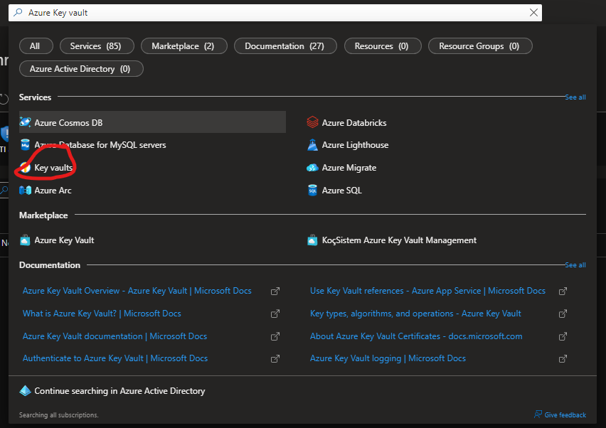

**2.-Le damos lo minimo para crear un recurso y nos pasamos a Acces Policy y tiene que estar configurado de la sig. manera:(Esto puede cambiar de que tipo de requerimientos requieras) Le damos en revisar y en crear y nos adentramos al recurso**

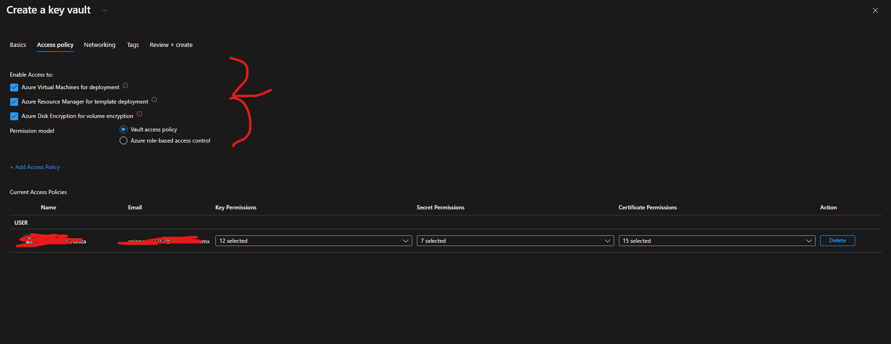

**3.-Nos vamos a la seccion de keys y le damos en Generate/Import**

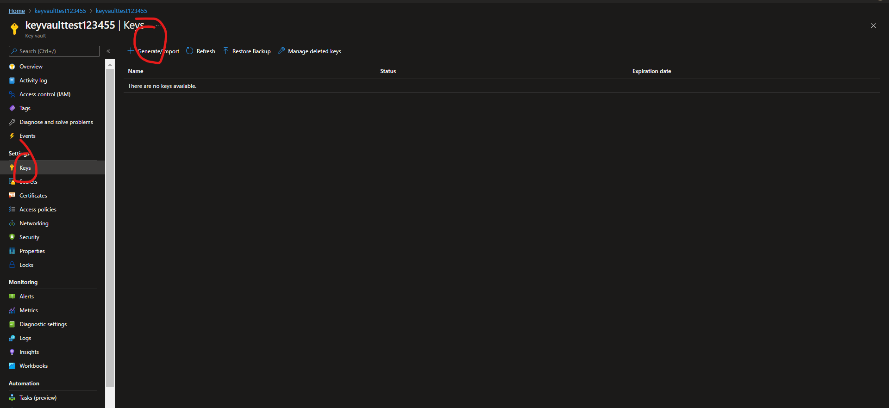

**4.-Creamos una llave de la sig manera: (Esto puede cambiar si requieres otro tipo de configuracion)**

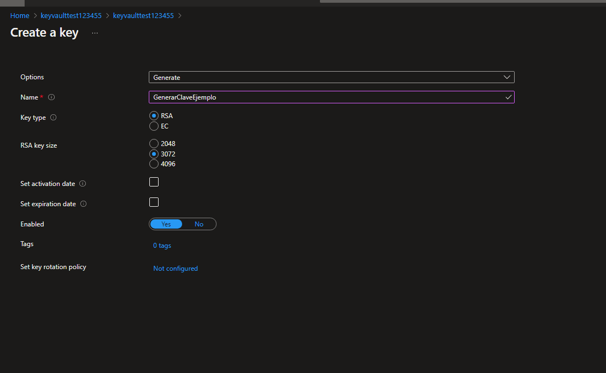

**5.-Como podras ver ya esta creado, lo seleccionamos**

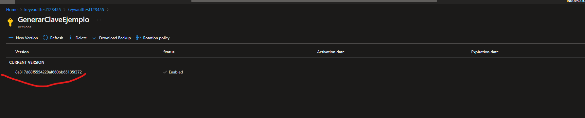

**6.-Aqui puedes cambiar la configuracion de la llave o copiar la url para tu pagina o lo que necesites**

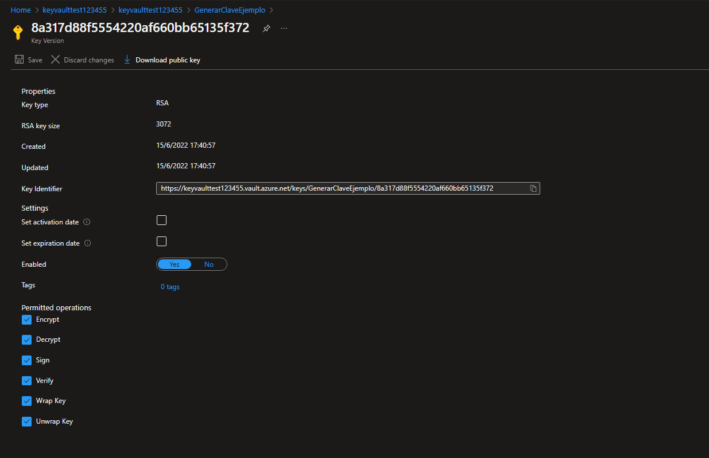

**7.-Ahora rerocedemos y damos en Secrets y damos en Generate/Import**
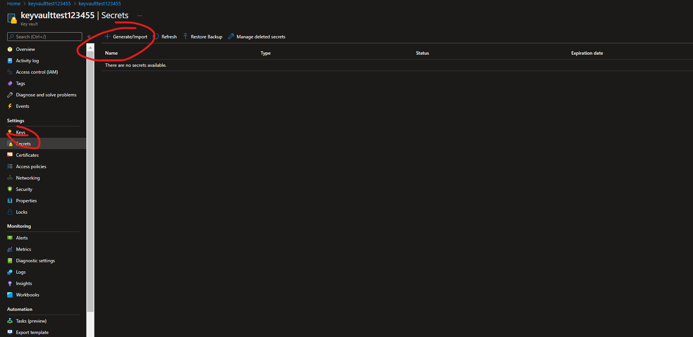

**8.-Ahora dentro le damos un nombre, la contraseña, el tipo de contenido y las demas configuraciones (puedes usar esto como ejemplo esto puede cambiar si requieres otro tipo de configuracion) y le das en create**

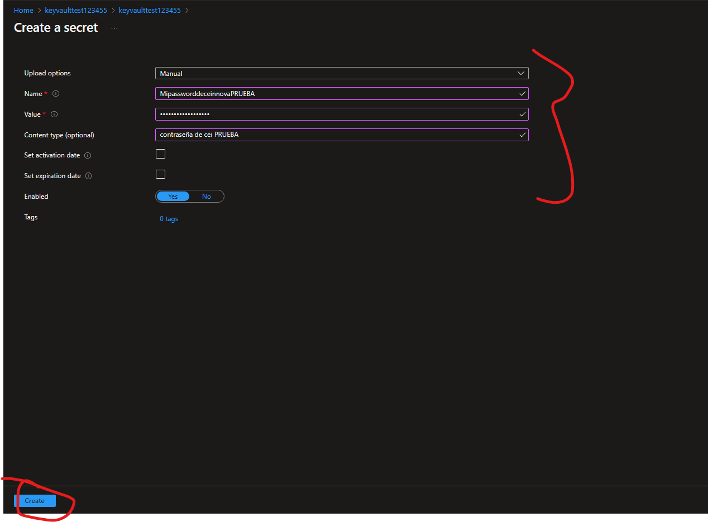

**9.-Ahora nos adentramos a la llave secreta, nos adentramos a la current version, podemos ver la contraseña con Show create value,**

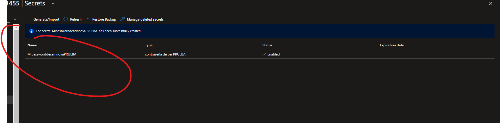

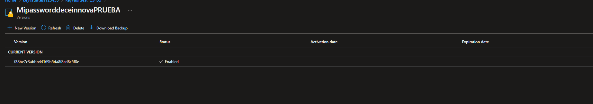

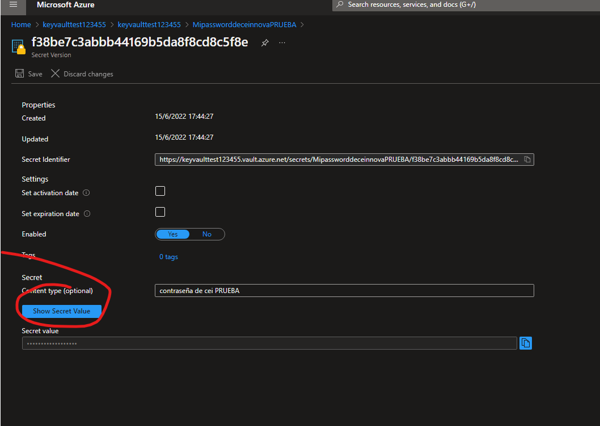

**10.-Podemos tambien generar certificados desde Key Vaults**

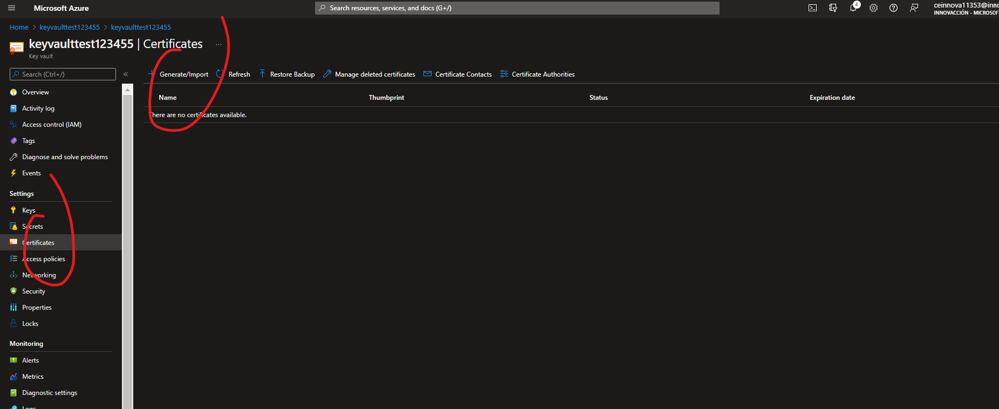